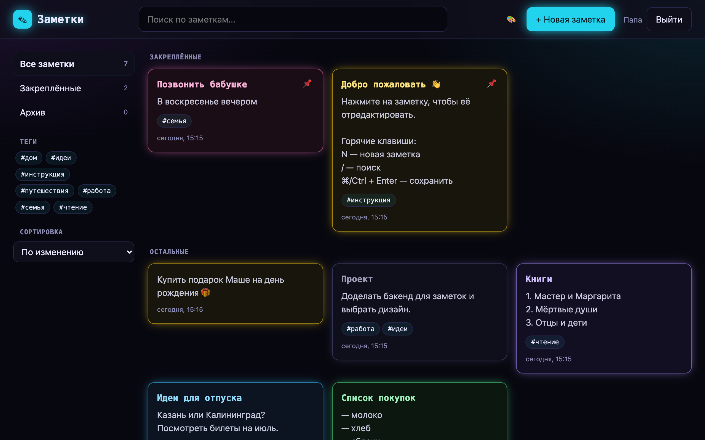

# Заметки

Веб-приложение для заметок с регистрацией и входом.



Есть пять дизайнов на выбор (кнопка 🎨 в шапке): Неон, Классика, Бумага, Стекло и Брутализм.
Скриншоты всех вариантов лежат в папке [дизайны](дизайны/).

- **Фронтенд** — `frontend/` (HTML, CSS, JS без сборки)
- **Бэкенд** — `backend/` (Python, FastAPI, SQLite)

## Запуск

```bash
python3 -m venv .venv
.venv/bin/pip install -r backend/requirements.txt
.venv/bin/uvicorn backend.main:app --reload
```

Откройте http://localhost:8000. Сервер отдаёт и API, и фронтенд.
Документация API: http://localhost:8000/docs

## База данных

SQLite, файл `backend/notes.db`. Он создаётся автоматически при первом запуске.
Схема описана в [backend/schema.sql](backend/schema.sql).

```
users 1 ──< sessions        (сессии входа)
users 1 ──< notes           (заметки пользователя)
```

| Таблица    | Что хранит |
|------------|------------|
| `users`    | логин, хеш пароля |
| `sessions` | хеш токена сессии, владелец, срок действия |
| `notes`    | заголовок, текст, теги (JSON), цвет, закреплена/в архиве, даты; `deleted_at` — метка удаления |

При удалении пользователя его сессии и заметки удаляются каскадно.

Посмотреть данные можно через консоль (`sqlite3` есть в macOS):

```bash
sqlite3 -header -column backend/notes.db "SELECT id, username FROM users;"
sqlite3 -header -column backend/notes.db "SELECT title, color, tags FROM notes WHERE deleted_at IS NULL;"
```

Или в графической программе [DB Browser for SQLite](https://sqlitebrowser.org).

## API

| Метод  | Путь                        | Описание                      |
|--------|-----------------------------|-------------------------------|
| POST   | `/api/auth/register`        | Регистрация `{username, password}` |
| POST   | `/api/auth/login`           | Вход `{username, password}`      |
| POST   | `/api/auth/logout`          | Выход                         |
| GET    | `/api/auth/me`              | Текущий пользователь          |
| GET    | `/api/notes`                | Список заметок                |
| POST   | `/api/notes`                | Создать заметку               |
| PATCH  | `/api/notes/{id}`           | Изменить заметку              |
| DELETE | `/api/notes/{id}`           | Удалить заметку               |
| POST   | `/api/notes/{id}/restore`   | Восстановить удалённую        |

## Авторизация

- Пароли хешируются через scrypt.
- После входа сервер ставит HttpOnly-cookie `session` на 30 дней.
- В базе хранится только хеш токена сессии.
- Каждый пользователь видит только свои заметки.

## Переменные окружения

- `NOTES_DB` — путь к файлу базы данных (по умолчанию `backend/notes.db`).
- `COOKIE_SECURE=1` — включите при работе по HTTPS.
